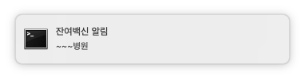

# leftover vaccine alarm

맥에서 이 프로그램을 켜 두시면 3초마다 한번씩 지역의 병원들의 잔여 백신 재고를 확인하여 잔여백신 존재시 맥 시스템 알림으로 알려드립니다.<br>
[이곳](https://sites.google.com/a/chromium.org/chromedriver/downloads) 에서 자신의 크롬 버전을 확인하여 알맞은 버전의 크롬드라이버를 다운로드 후 `main.py` 파일과 동일 폴더에 넣어 아래 실행법을 이용해 실행해 주세요.

### 지원 OS

* OSX

### 실행법

```sh
python3 main.py
```

### ScreenShot

스크린샷은 예시입니다.

